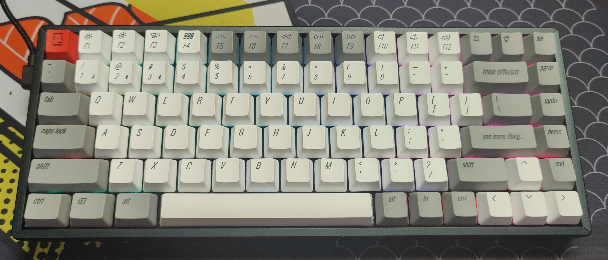
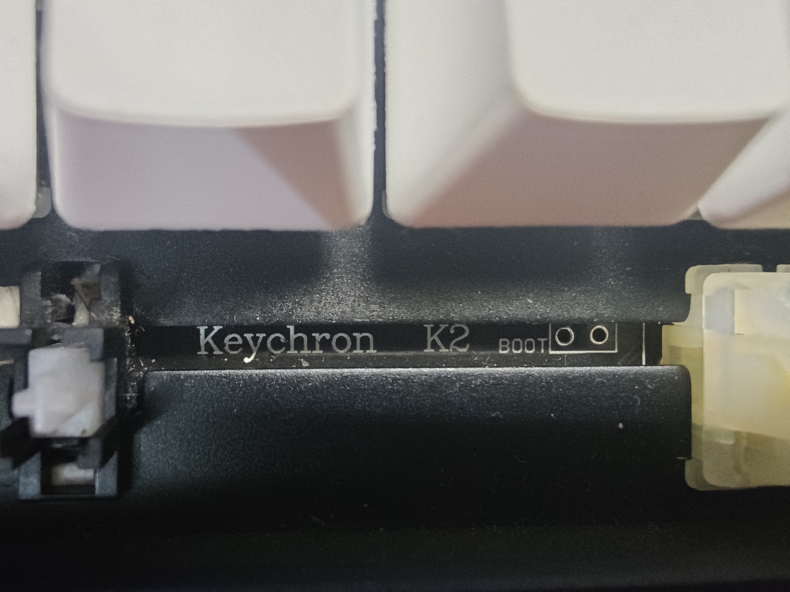
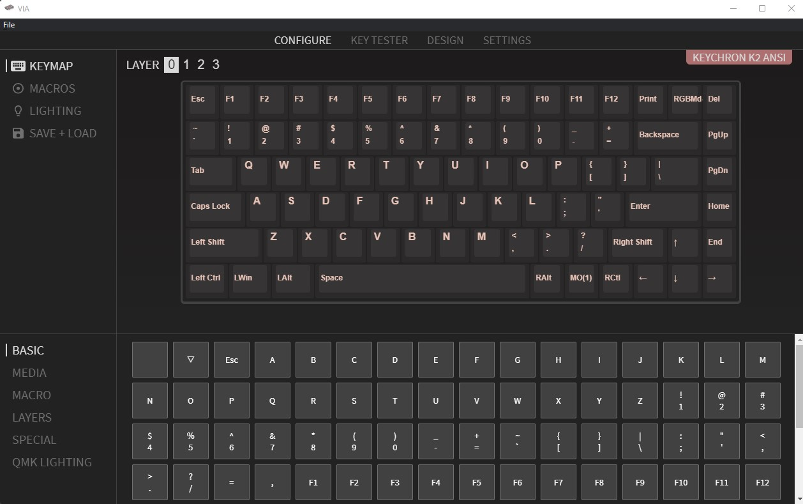

# Installing QMK on Keyhcron K2 V2 RGB
This guide will walk you through on installing QMK on a Keychron K2 V2 RGB keyboard. Even though repos exist for other models and the white backlit version, this guide will only cover the K2 V2 RGB model with a SN32F24x MCU. 

This guide is made possible because of and as an extension to [CanUnesi/QMK-on-K6](https://github.com/CanUnesi/QMK-on-K6)

**There is a small chance that you may brick your keyboard in the flashing process, continue at your own risk. Use an appropriate cable, make sure you won’t lose power during flashing and follow the steps carefully.**

**SonixQMK in its current incarnation (atleast for K2) does not support Bluetooth or very fancy RGB effects and flashing your keyboard will disable the bluetooth entirely.**

This guide will have instructions to build and flash SonixQMK on K2 V2 RGB.

I have not tried reverting to the original firmware after flashing SonixQMK, so this guide may be a one way road - Try it at your own risk.

This guide assumes that you have the stock bootloader and not Sonix Jumploader.

## Contents
[1. Get Sonix Flasher](#1-get-sonix-flasher)

[2. Setting Up the Environment - QMK MSYS](#2-setting-up-the-environment---qmk-msys)

[3. Checking Your MCU and Entering Boot Mode](#3-checking-your-mcu-and-entering-boot-mode)

[4. Flash the Keyboard](#4-flash-the-keyboard)

[5. Instructions for VIA](#5-instructions-for-via)

&nbsp; 

## 1. Get Sonix Flasher
### 1.1. Go to https://github.com/SonixQMK/sonix-flasher/releases/latest
### 1.2. Download "flasher-win.zip"
### 1.3. Unzip the archive to a convenient place such as your desktop
### 1.4. Open "Sonix Keyboard Flasher.exe" and check whether the keyboard is identified as Keychron.

## 2. Setting Up the Environment - QMK MSYS
### 2.1. Download the latest release (QMK_MSYS.exe) from [this repo](https://github.com/qmk/qmk_distro_msys/releases/latest).
### 2.2. Run the .exe and follow instructions.
### 2.3. Run QMK MSYS
You can hit the windows key and type “QMK MSYS” to find the program
### 2.4. Clone the SonixQMK repository
    git clone https://github.com/SonixQMK/qmk_firmware.git
### 2.5. Change directory to qmk_firmware
	cd qmk_firmware
### 2.6. Pull the submodules
	make git-submodule
### 2.7. Install utilities
	util/qmk_install.sh
>Note: You might need to run this twice if the QMK MSYS terminal is closed in the process.
### 2.8. Make default firmware
Depending on your [keyboard layout](https://upload.wikimedia.org/wikipedia/commons/1/14/Physical_keyboard_layouts_comparison_ANSI_ISO.png):

    make keychron/k2/rgb/via:default

### 2.9. Navigate to the qmk directory
### 2.10. Locate and copy the .bin file
Depending on your layout, copy “keychron_k2_rgb_via_default.bin” to a folder for easily locating it later

## 3. Checking Your MCU and Entering Boot Mode
### 3.1. Remove the space bar key to view the version and boot pins

### 3.2. Check whether the version is RGB-BC Ver 1.1

### 3.3. Disconnect the keyboard and use tweezers to short the boot pins

### 3.4. Plug in the keyboard with boot pins shorted
### 3.5. Open Sonix Flasher and check if the Keyboard is identified as SN32F248B (bootloader)

**If the SN32 bootloader is correctly identified, proceed to next section else stop at this point and troubleshoot**
### 3.6. Remove the tweezers shorting the boot pins

## 4. Flash the Keyboard
### 6.1. Make sure you have picked SN32F24x for the device and 0x00 for qmk offset (as shown below)

### 6.2. This is the point of no return, click “Flash QMK…” and choose the .bin file you created. It will flash as soon as you choose the file.
## *Congratulations, you have flashed QMK into your K2!*

## 5. Instructions for VIA
### 5.1 Download VIA from [https://caniusevia.com/](https://caniusevia.com/)
### 5.2 download via_ansi.json from [Sonix QMK keymaps](https://github.com/SonixQMK/qmk_firmware/tree/sn32/keyboards/keychron/k2/keymaps/default) 
### 5.3 Open VIA and navigate to settings
### 5.4 Enable show design tab
### 5.5 Navigate to Design tab and load the via_ansi.json to load the K2 design into VIA 
